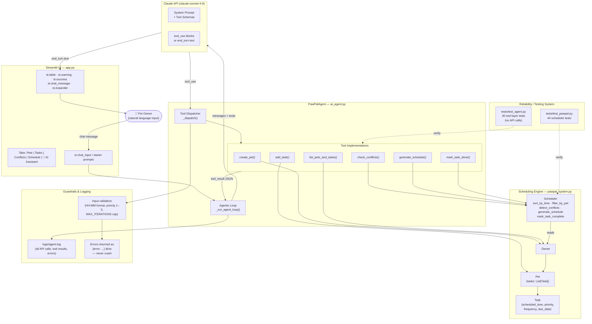

# PawPal+ System Architecture Diagram

Paste this Mermaid code at https://mermaid.live to render and export as `system_diagram.png`.



## Component responsibilities

| Component | Role |
|---|---|
| **Streamlit UI** | Renders the 5-tab interface; holds session state for owner, scheduler, agent, and chat history |
| **PawPalAgent** | Runs the agentic loop: sends messages to Claude, executes tool calls, feeds results back, repeats until `end_turn` |
| **Claude API** | Plans which tools to call and in what order; produces the final plain-language response |
| **Tool layer** | Thin adapters that translate Claude's JSON inputs into calls against `pawpal_system.py` classes |
| **Scheduling Engine** | Pure Python logic — `Owner`, `Pet`, `Task`, `Scheduler`; the single source of truth for all data |
| **Logging** | Every API call, tool invocation, and error is written to `logs/agent.log` |
| **Guardrails** | Time format validation, priority range check, `MAX_ITERATIONS` cap, error dicts instead of exceptions |
| **Test suite** | 30 tool-layer tests (no API) + 44 scheduler tests = 74 total; CI-safe |

## Data flow

```
User types: "Add daily morning walk for Buddy at 7:30"
    ↓
PawPalAgent.chat()
    ↓
Claude sees message + tool schemas → responds with tool_use: add_task(...)
    ↓
_dispatch("add_task", {pet_name:"Buddy", task_name:"Morning Walk", ...})
    ↓
Pet.add_task(Task(scheduled_time="07:30", ...))   ← pawpal_system.py
    ↓
tool_result JSON fed back to Claude
    ↓
Claude responds: "I've added a 30-minute morning walk for Buddy at 7:30 AM..."
    ↓
st.chat_message("assistant") renders reply + UI tabs update automatically
```
