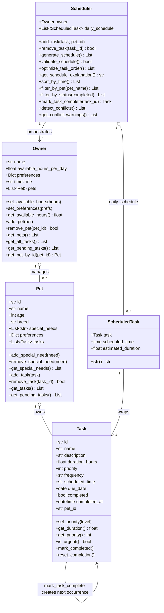

# PawPal+ — Final Class Diagram

Render this Mermaid diagram at https://mermaid.live to export as `uml_final.png`.

## Key relationships added in Phase 3

| Change | Why |
|---|---|
| `Task.scheduled_time: str` | Enables `sort_by_time()` using lambda key on `"HH:MM"` string |
| `Task.due_date: date` | Stores next-occurrence date created by `mark_task_complete()` |
| `Scheduler.sort_by_time()` | New method — returns all tasks sorted chronologically |
| `Scheduler.filter_by_pet()` | New method — scopes task list to one pet by name |
| `Scheduler.filter_by_status()` | New method — splits tasks by completion flag |
| `Scheduler.mark_task_complete()` | Extended completion: auto-creates recurring next task via `timedelta` |
| `Scheduler.detect_conflicts()` | New method — `itertools.combinations` overlap check |
| `Scheduler.get_conflict_warnings()` | New method — wraps conflicts as plain warning strings |
